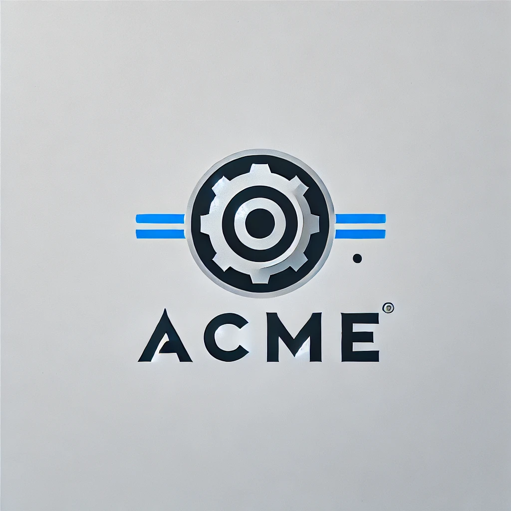

<h1 align="center">
  
</h1>

<h3 align="center">Prueba de código Senior Backend Developer (Acme)</h3>

## Introducción

En ACME para todos los sistemas internos y su frontend se quiere utilizar un formato estandarizado de reserva
que no dependan del formato de la fuente (PMS). Para ello se necesita diseñar e implementar endpoint en un
API REST HTTP que permita consultar para un ID de hotel en ACME y número de habitación si existe una
estancia activa.

## Requerimientos

- Composer.
- PHP >= 8.1
- MySQL/MariaDB.

## Instalación

```bash
composer install
mysql -u [MYSQL_ADMIN_USER] -p[MYSQL_ADMIN_PASSWORD]

mysql> CREATE USER "acme_user"@"localhost" IDENTIFIED BY "ryrj7sdLCWg9";
mysql> GRANT ALL PRIVILEGES ON acme_db.* TO "acme_user"@"localhost";
mysql> CREATE SCHEMA `acme_db` DEFAULT CHARACTER SET utf8 ;
mysql> exit

php vendor/bin/doctrine orm:schema-tool:create
```

A continuación hay que configurar en nuestro servidor web (Apache, Nginx, etc), un VirtualHost que apunte como DocumentRoot a la carpeta `public` del proyecto.

Para este manual usaremos el dominio `dev.acme-app.com`.


## Slim Micro Framework

Tras probar varias opciones he decidido usar [Slim PHP micro framework](https://www.slimframework.com) por las siguientes razones:

- Una de las características que se valorará en la prueba es el rendimiento y eficiencia. En mi carrera he tenido la suerte de trabajar con diferentes frameworks. Por lo que considero que, este en concreto, es el más ligero para desarrollar APIs.
- La instalación es sencilla y requiere de muy poca configuración para hacerlo funcionar.

## Dependencias

Tras analizar el problema propuesto, he identificado dos dependencias principales para la aplicación.

- ### PMS

>Se trata de un Webservice que nos proporciona el cliente, en este caso una cadena hotelera, y que sirve como fuente de datos de nuestra aplicación.

- ### BBDD

>Necesitamos una Base de Datos para ir almacenando toda la información que vamos obteniendo del PMS. De forma que la siguiente vez que se solicite, la sirvamos directamente desde está Base de Datos, reduciendo los tiempos de respuesta.

Siendo fieles a los principios SOLID y suponiendo que queremos que nuestra aplicación sea escalable y mantenible a largo plazo, no debemos permitir que, en nuestro código, estos dos servicios dependan directamente de nuestra lógica de negocio.

Si por ejemplo, en el futuro, la cadena hotelera nos informa de un cambio importante en su PMS, que afecta directamente a la integración, o decidimos migrar nuestra BBDD a otro motor, MongoDB por ejemplo, esto implicaría tener que refactorizar código del core de nuestra aplicación, con el coste en tiempo y pruebas que ello supondría.

Para solucionar esto, en este proyecto se hace uso del principio SOLID de Inversión de Dependencias, por el cual nuestra lógica simplemente dependerá de interfaces que pueden ser implementadas por cualquier otro servicio. En el caso que nos ocupa, nuestro PMS y MySQL.

## API Rest

Tal y como se solicita en la definición de la prueba técnica, el API Rest construido dispone de un único endpoint que permite consultar para un ID de hotel en ACME y número de habitación si existe una estancia activa.

### Documentación

Para ver los detalles de dicho endpoint, parámetros admitidos, tipos de respuesta, código de error y demás características, he creado una documentación con Swagger que puede ser consultada en las siguiente URL del proyecto:

http://dev.acme-app.com/doc/

## Excepciones

Además de las excepciones genéricas de Slim, he creado estas 3 excepciones dentro del servicio PMS

- Hotel no encontrado: Se lanza cuando el identificador del hotel dado no existe.
- No hay reservas. Se lanza cuando el PMS no devuelve ninguna reserva.
- No hay reservas para el hotel y habitación. Se lanza cuando no encontramos coincidencias en nuestro PMS, buscando por los parámetros dados

## Tests

He creado también un caso de test unitario sencillo que prueba el correcto funcionamiento del API.
Ejecuta una llamada al endpoint y realiza los siguiente asserts:

- Comprueba que el endpoint devuelva un HTTP Code 200.
- Comprueba que el JSON resultante incluya las siguientes cadenas:
  - `bookingId`
  - `hotel`
  - `room`
- Comprueba que el JSON resultante NO incluya la cenada `error`.

### Ejecución

```bash
./vendor/phpunit/phpunit/phpunit ./tests/TestCase/BookingTest.php
```

NOTA: Obviamente, en un proyecto real, se pueden crear muchos más casos. Habría que analizar cuales son las funcionalidades más críticas de nuestro negocio y realizar casos de tests para las mismas. A efectos de esta prueba, he creado solo una, ya que únicamente quiero mostrar mi destreza en este ámbito.

### Conclusiones

Este proyecto no deja ser una prueba técnica, en la que he intentado incluir una muestra de las funcionalidades que se usarían en un proyecto real.

También he intentado mantener el código limpio y ordenado, así como aislar todas aquellas dependencias que no pertenecen a la lógica de negocio y que son susceptibles de cambiar en el futuro, para obtener un código altamente escalable y mantenible a largo plazo.

No obstante, antes de afrontar un proyecto real de estas características, debemos:

- Tener un conocimiento a fondo del negocio.
- Hacer un análisis y diseño de la arquitectura a implementar,
- Establecer la diferencia entre la lógica propia de negocio y las dependencias.
- Decidir las piezas de software (framework, librerías, etc) que vamos a utilizar.
- Identificar las funcionalidades críticas sobre las que debemos desarrollar casos de test.
- Documentar todo este trabajo, antes de comenzar el desarrollo, para sentar las bases del proyecto.
